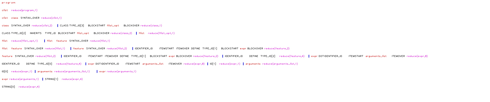

# Compilers Project

## Team members

| 成員 | 貢獻 |
| --- | --- |
| 資工三 108590017 林銘政 | 虛擬機操作, 範例查詢 |
| 資工三 108590045 廖永誠 | 程式碼邏輯撰寫, 報告製作 |

## Environment

- 使用Ubuntu20.04.1
- 需有以下套件
    
    ```bash
    sudo apt-get install flex
    sudo apt-get install bison
    ```
    
- Github地址
    
    [110-2-Compilers-Homework/project at main · DandinPower/110-2-Compilers-Homework](https://github.com/DandinPower/110-2-Compilers-Homework/tree/main/project)
    

## Target Language

- 使用Standford CS143課程所提供的Coolc作為本次專案的target language
- 該語言的Document
    
    [](http://web.stanford.edu/class/cs143/materials/cool-manual.pdf)
    

### Grammar

```
0 $accept: program $end

1 program: clist

2 clist: clist class SYNTAX_OVER
3      | class SYNTAX_OVER

4 class: CLASS TYPE_ID BLOCKSTART flist_opt BLOCKOVER
5      | CLASS TYPE_ID INHERITS TYPE_ID BLOCKSTART flist_opt BLOCKOVER

6 flist_opt: flist
7          | %empty

8 flist: flist feature SYNTAX_OVER
9      | feature SYNTAX_OVER

10 feature: IDENTIFIER_ID ITEMSTART formal_list ITEMOVER DEFINE TYPE_ID BLOCKSTART expr BLOCKOVER
11        | IDENTIFIER_ID ITEMSTART ITEMOVER DEFINE TYPE_ID BLOCKSTART expr BLOCKOVER
12        | IDENTIFIER_ID DEFINE TYPE_ID ASSIGN expr
13        | IDENTIFIER_ID DEFINE TYPE_ID

14 formal_list: formal_list NEXT formal
15            | formal

16 formal: IDENTIFIER_ID DEFINE TYPE_ID

17 block_list: block_list expr SYNTAX_OVER
18           | expr SYNTAX_OVER

19 arguments_list: arguments
20               | %empty

21 arguments: arguments NEXT expr
22          | expr

23 action_list: action_list action
24            | action

25 action: IDENTIFIER_ID DEFINE TYPE_ID DO expr SYNTAX_OVER

26 let_action: IDENTIFIER_ID DEFINE TYPE_ID IN BLOCKSTART block_list BLOCKOVER
27           | IDENTIFIER_ID DEFINE TYPE_ID ASSIGN expr IN BLOCKSTART block_list BLOCKOVER

28 expr: IDENTIFIER_ID
29     | DIGIT
30     | BOOLEAN
31     | LETTER
32     | SELF
33     | BLOCKSTART block_list BLOCKOVER
34     | IDENTIFIER_ID ASSIGN expr
35     | expr DOT IDENTIFIER_ID ITEMSTART arguments_list ITEMOVER
36     | expr AT TYPE_ID DOT IDENTIFIER_ID ITEMSTART arguments_list ITEMOVER
37     | IDENTIFIER_ID ITEMSTART arguments_list ITEMOVER
38     | expr OPERATOR expr
39     | ITEMSTART expr ITEMOVER
40     | IF expr THEN expr ELSE expr FI
41     | WHILE expr LOOP expr POOL
42     | LET let_action
43     | CASE expr OF action_list ESAC
44     | NEW TYPE_ID
45     | ISVOID expr
46     | NOT expr
47     | INT_COMP expr
```

## 使用說明

- 編譯scanner跟parser
    
    ```bash
    bison -vdty coolc.y
    flex coolc.l
    gcc -o coolc y.tab.c lex.yy.c
    ```
    
- 使用parser辨識測試資料
    
    ```bash
    ./coolc < "Test case path"
    ```
    

## 輸出說明

- 輸出使用到的文法規則
    - EX. 如果使用reduce到expr的第5個規則就會輸出
        
        ```
        expr 5
        ```
        
- 全部辨識完畢且正確
    - 輸出Done
        
        ```
        Done!
        ```
        
- 輸出Symbol Table結果
    - EX.使用到了Identifier
        
        ```
        ID: [<編號>]: <實際儲存的字串>
        ```
        
- 輸出Syntax Tree解析結果
    - 根據解析結果分行輸出該文法規則的token, 文法規則, syntax tree深度
        
        ```
        clist class SYNTAX_OVER reduce(clist,1) depth(1)
        #token token token      文法規則         深度
        ```
        

## 輸出結果

- Test case
    - 輸入指令
    
    ```
    ./coolc < test/test1.txt
    ```
    
    - 輸出結果
    
    
    
- error case
    - 輸入指令
    
    ```
    ./coolc < test/error.txt
    ```
    
    - 輸出結果
    
    
    

## 可視化Syntax Tree

- 內建的測資為test1.txt
    
    ```
    class Test inherits IO{
        printer:IO;
        test():Int {
            printer.out_string("Hello World!\n")
        };
    };
    
    class Main {
        printer2:Test;
        main():Int {
            printer2.out_string("Today Is Good!\n")
        };
    };
    ```
    
- 根據解析器轉換完的結果
    
    ```
    clist reduce(program,1) depth(0) 
    clist class SYNTAX_OVER reduce(clist,1) depth(1) 
    CLASS TYPE_ID[3] BLOCKSTART flist_opt BLOCKOVER reduce(class,1) depth(2) 
    flist reduce(flist_opt,1) depth(3) 
    flist feature SYNTAX_OVER reduce(flist,1) depth(4) 
    IDENTIFIER_ID ITEMSTART ITEMOVER DEFINE TYPE_ID[1] BLOCKSTART expr BLOCKOVER reduce(feature,2) depth(5) 
    expr DOT IDENTIFIER_ID ITEMSTART arguments_list ITEMOVER reduce(expr,8) depth(6) 
    arguments reduce(arguments_list,1) depth(7) 
    expr reduce(arguments,1) depth(8) 
    STRING[1] reduce(expr,4) depth(9) 
    ID[1] reduce(expr,1) depth(7) 
    feature SYNTAX_OVER reduce(flist,2) depth(5) 
    IDENTIFIER_ID DEFINE TYPE_ID[2] reduce(feature,4) depth(6) 
    class SYNTAX_OVER reduce(clist,2) depth(2) 
    CLASS TYPE_ID[2] INHERITS TYPE_ID BLOCKSTART flist_opt BLOCKOVER reduce(class,2) depth(3) 
    flist reduce(flist_opt,1) depth(4) 
    flist feature SYNTAX_OVER reduce(flist,1) depth(5) 
    IDENTIFIER_ID ITEMSTART ITEMOVER DEFINE TYPE_ID[1] BLOCKSTART expr BLOCKOVER reduce(feature,2) depth(6) 
    expr DOT IDENTIFIER_ID ITEMSTART arguments_list ITEMOVER reduce(expr,8) depth(7) 
    arguments reduce(arguments_list,1) depth(8) 
    expr reduce(arguments,1) depth(9) 
    STRING[0] reduce(expr,4) depth(10) 
    ID[0] reduce(expr,1) depth(8) 
    feature SYNTAX_OVER reduce(flist,2) depth(6) 
    IDENTIFIER_ID DEFINE TYPE_ID[0] reduce(feature,4) depth(7)
    ```
    
- 運行visualization.py來解析上面的測資
    
    ```
    python visualization.py
    ```
    
- 運行結果
    
    